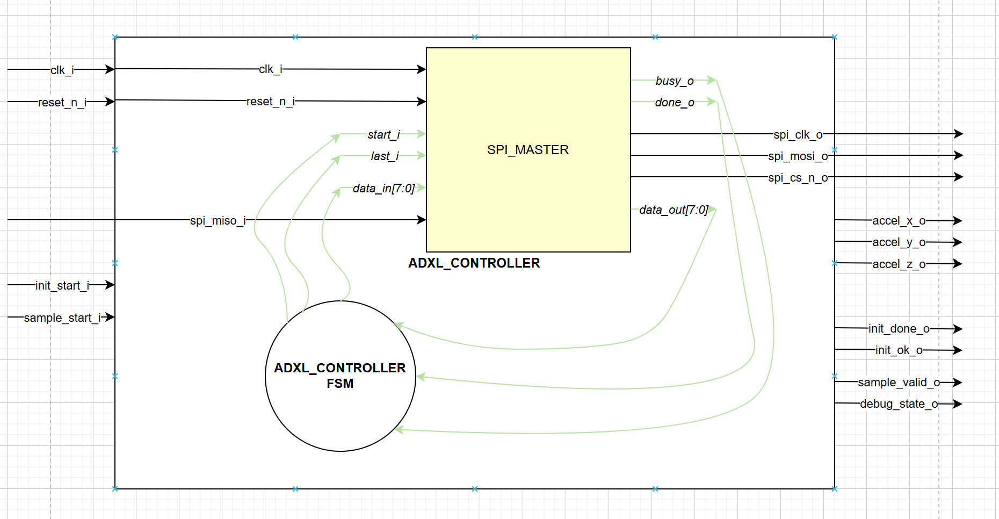

### **ADXL345 Controller Module (`adxl345_controller`)**
## 1. Overview
The **`adxl345_controller`** is the protocol-level engine of the acquisition sub-system. It implements the Finite State Machine (FSM) required to interface with the ADXL345 registers via SPI. 

* **State Management**: It handles the precise sequence of SPI commands needed to initialize the sensor (e.g., setting the `DATA_FORMAT` and `POWER_CTL` registers) and manages the continuous burst-read cycles to fetch acceleration data.
* **Register-Level Control**: It translates high-level acquisition requests into specific 8-bit register addresses and handles the timing for bidirectional data exchange.
* **Data Output**: After completing a burst read, it assembles the raw bytes into three 16-bit signed integers ($A_x, A_y, A_z$) and pulses the `data_ready` signal to notify the parent module.

---
## 2. Block Diagram

  

---

## 3. Port Descriptions

The table below summarizes the control and data interface of the controller:

| Signal | Direction | Type | Description |
| :--- | :---: | :---: | :--- |
| **`clk_i`** | Input | `std_logic` | Main system clock. |
| **`reset_n_i`** | Input | `std_logic` | Asynchronous active-low reset. |
| **`init_start_i`** | Input | `std_logic` | Pulse to trigger the sensor initialization sequence. |
| **`init_done_o`** | Output | `std_logic` | Asserted when the sensor configuration is complete. |
| **`init_ok_o`** | Output | `std_logic` | Status flag indicating the sensor passed the ID check. |
| **`sample_start_i`** | Input | `std_logic` | Pulse to trigger a single X, Y, Z data burst read. |
| **`sample_valid_o`** | Output | `std_logic` | Indicates that output data signals are stable and valid. |
| **`accel_x/y/z_o`** | Output | `signed(15:0)` | 16 bit 2's complement acceleration data for each axis. |
| **`debug_state_o`** | Output | `std_logic_vector` | 4 bit state encoding. |
| **`spi_...`** | - | - | Physical SPI signals connected to the ADXL345. |

---

## 4. Detailed FSM Logic

The `adxl345_controller` uses a Finite State Machine (FSM) to sequence the SPI transactions. Each state is mapped to a 4-bit debug value for real-time monitoring.

### A. Idle & Dispatch State
* **`S_IDLE` (0x0)**: The default state. It waits for `init_start_i` to begin the boot sequence. Once initialized (`init_ok_r` is high), it listens for `sample_start_i` to trigger a data read.

### B. Initialization Phase
This sequence configures the sensor's internal registers to the required specifications:

* **`S_INIT_SEND_DEVID_CMD` (0x1)**: Sends `0x80` (Read command for register 0x00). `spi_last` is '0' to keep the transaction open.
* **`S_INIT_READ_DEVID_DATA` (0x2)**: Sends a dummy byte to clock in the Device ID. `spi_last` is '1' to close the transaction.
* **`S_INIT_SEND_BW_RATE_ADDR` (0x3)**: **Validation Step.** Checks if `spi_dout` is `0xE5` (DEVICE ID).
    * *Success*: Sends address `0x2C` (`BW_RATE`).
    * *Failure*: Jumps to `S_ERROR`.
* **`S_INIT_SEND_BW_RATE_DATA` (0x4)**: Writes `0x0D` to set the output data rate to 800 Hz.
* **`S_INIT_SEND_DATA_FORMAT_ADDR` (0x5)**: Sends address `0x31` (`DATA_FORMAT`).
* **`S_INIT_SEND_DATA_FORMAT_DATA` (0x6)**: Writes `0x08` for Full Resolution and ±2g range.
* **`S_INIT_SEND_POWER_CTL_ADDR` (0x7)**: Sends address `0x2D` (`POWER_CTL`).
* **`S_INIT_SEND_POWER_CTL_DATA` (0x8)**: Writes `0x08` to enable **Measurement Mode**.
* **`S_INIT_DONE` (0x9)**: Sets the `init_ok` flag and pulses `init_done_o`. Returns to `S_IDLE`.

### C. Sampling Phase (Burst Read)
This phase performs a single 7-byte SPI transaction (1 command + 6 data bytes) to ensure X, Y, and Z axes are sampled at the same instant.

* **`S_SAMP_SEND_BURST_CMD` (0xA)**: Sends `0xF2` (Read + Multiple Byte bit + Address 0x32).
* **`S_SAMP_READ_X_LSB` (0xB)**: Reads the X-axis LSB.
* **`S_SAMP_READ_X_MSB` (0xC)**: Stores X-LSB in `b0`, reads X-MSB.
* **`S_SAMP_READ_Y_LSB` (0xD)**: Stores X-MSB in `b1`, reads Y-LSB.
* **`S_SAMP_READ_Y_MSB` (0xE)**: Stores Y-LSB in `b2`, reads Y-MSB.
* **`S_SAMP_READ_Z_LSB` (0xF)**: Stores Y-MSB in `b3`, reads Z-LSB.
* **`S_SAMP_READ_Z_MSB`**: Stores Z-LSB in `b4`. Sets `spi_last` to '1' to end the burst after this byte.
* **`S_SAMP_DONE`**: 
    1. Captures Z-MSB into `b5`.
    2. Reconstructs 16-bit signed values: `accel_x <= b1 & b0`, `accel_y <= b3 & b2`, `accel_z <= b5 & b4`.
    3. Asserts `sample_valid_o` for one clock cycle.
    4. Returns to `S_IDLE`.

### D. Fault State
* **`S_ERROR` (0xE)**: Entered if the sensor returns an invalid ID. The controller stays in this state until a hard reset occurs, ensuring the system does not process incorrect data.

---

## 4. Implementation Details
* **Data Integrity**: The module uses internal buffers (`b0` to `b5`) to store raw bytes. Output registers are only updated at the end of the burst (`S_SAMP_DONE`) to prevent "jittery" data during reading.
* **Safety Lock**: The controller features an internal safety check (`init_ok_r`). It will ignore any `sample_start_i` requests until the initialization has successfully verified the sensor's presence.
