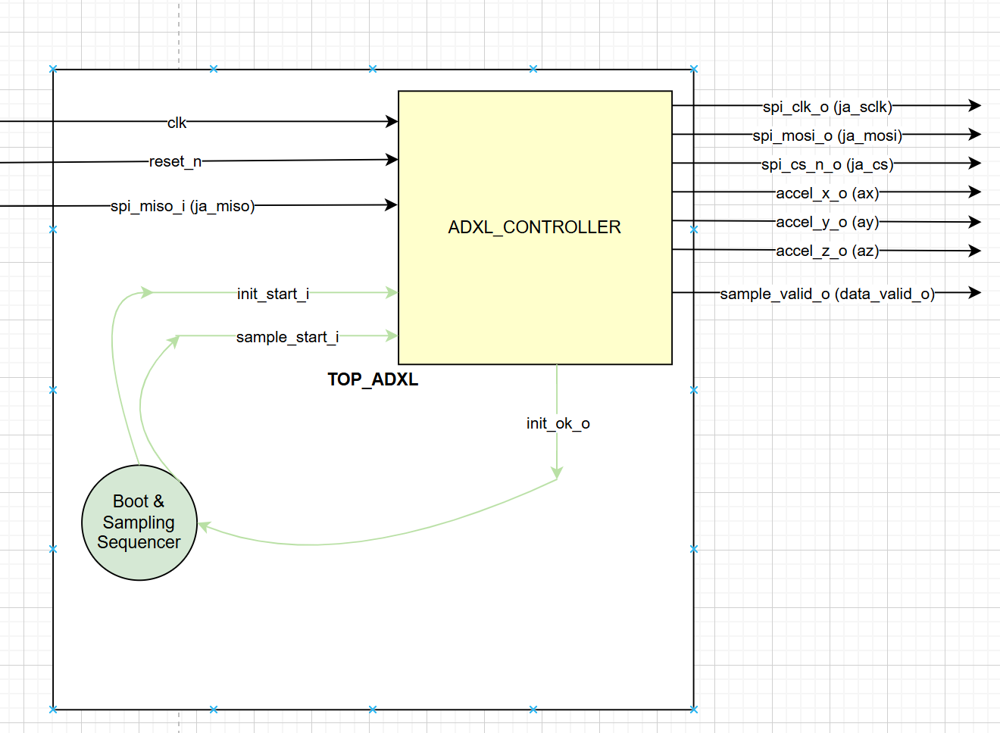
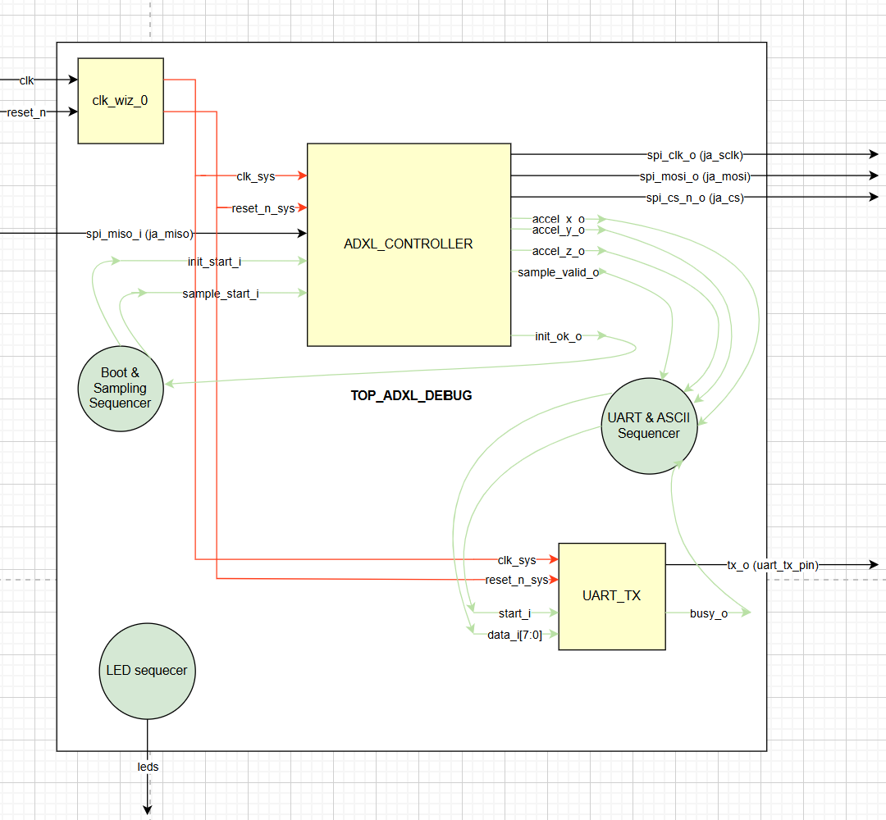
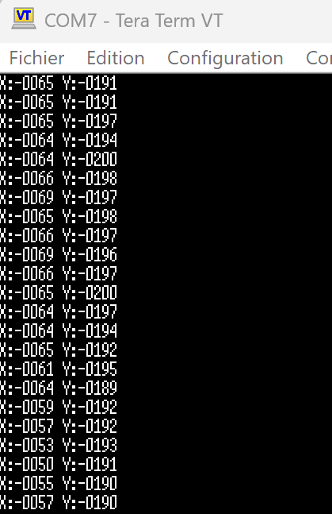
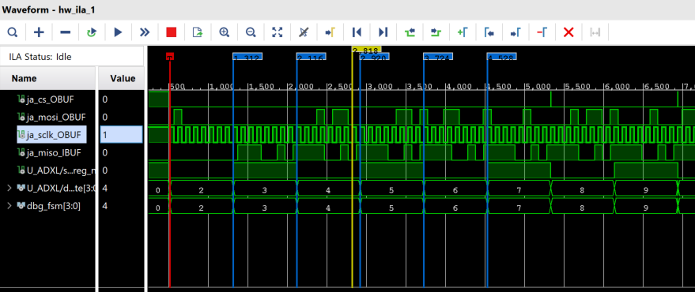
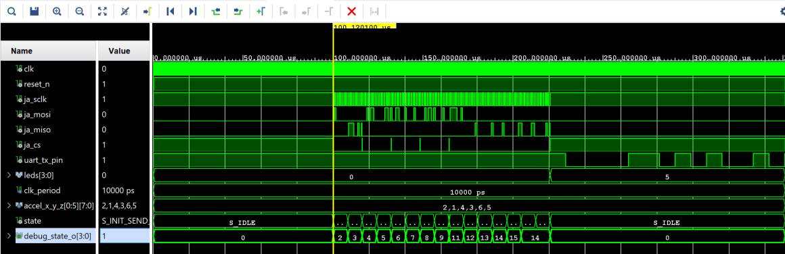

# **Accelerometer Sub-System Modules (`top_adxl` & `top_adxl_debug`)**

## **1. Overview**
The modules in this directory are **not** the final system-level tops. They are **Accelerometer Sub-Systems** designed to manage the ADXL345 sensor and provide processed data to a higher-level entity (such as a global `top_system` with Ethernet integration).

To facilitate both development and final integration, two versions of this sub-system are provided:
* **`top_adxl` (Integration Module)**: The core production unit. It is designed to be instantiated within the final `top_system`. It provides synchronized 16-bit X, Y, and Z data vectors (totaling 48 bits of payload) accompanied by a validation strobe to the Ethernet Packet Builder.
* **`top_adxl_debug` (Hardware Validator)**: A standalone wrapper used to verify the physical SPI link on the Arty-A7 before integration. It includes local "debug-only" peripherals (UART/LEDs).

---

## **2. System Hierarchy & Integration**

In the final project, the `top_adxl` module acts as a leaf in the hierarchy, sitting alongside the Ethernet stack. It is a dedicated engine for sensor management.

```text
top_system (Final Top)
├── clk_wiz_0 (Global Clocking)
├── top_eth (Ethernet Stack)
└── top_adxl (THIS MODULE)
    └── adxl345_controller
        └── spi_master
```


---

## **3. Functional Variants**

### **A. Integration Version (`top_adxl`)**
* **Context**: Used as a component within the final `top_system`.
* **Clocking**: External. It expects a **25 MHz** clock provided by the system's main PLL.
* **Interface**: All debug logic (UART/LEDs) is stripped away to minimize resource usage and prioritize the Ethernet data path.
* **Constraints**: Integrated into the global system constraints.

<p align="center">
  
</p>

---

### **B. Standalone Debug Version (`top_adxl_debug`)**
* **Context**: Used for initial hardware bring-up on the Arty-A7.
* **Clocking**: Internal. It manages its own 100MHz to 25MHz conversion via a local **Clock Wizard (PLL)**.
* **Diagnostic Tools**: Provides real-time ASCII streaming via UART and visual tilt feedback via LEDs.
* **Constraints**: **IMPORTANT** - You must use the **`arty_a7_adxl_debug.xdc`** constraint file to map the UART pins and LEDs correctly.

<p align="center">
  
</p>

## **4. Input/Output Signals**

| Signal | Direction | Type | Description |
| :--- | :---: | :---: | :--- |
| **`clk`** | Input | `std_logic` | Global clock (100MHz for Debug / 25MHz for Integration). |
| **`reset_n`** | Input | `std_logic` | Active-low asynchronous reset. |
| **`ja_sclk`** | Output | `std_logic` | SPI Serial Clock (CPOL=1, CPHA=1). |
| **`ja_mosi`** | Output | `std_logic` | Master Out Slave In - Data to sensor. |
| **`ja_miso`** | Input | `std_logic` | Master In Slave Out - Data from sensor. |
| **`ja_cs`** | Output | `std_logic` | Active-low Chip Select to enable ADXL345. |
| **`uart_tx_pin`** | Output | `std_logic` | **Debug Only**: Serial output for PC (Tera Term). |
| **`leds[3:0]`** | Output | `std_logic_vector` | **Debug Only**: Visual tilt feedback. |
| **`ax/y/z_o[15:0]`** | Output | `std_logic_vector` | **Integration Only**: Raw acceleration (Signed 16-bit). |
| **`data_valid_o`** | Output | `std_logic` | **Integration Only**: Data strobe for network trigger. |


---

## **5. Internal Sequencer & Timing**
The sub-system ensures sensor stability through precise timing control:

1. **Power-up Delay**: The `heartbeat_cpt` implements a **100 µs wait** before the first SPI command. This allows the ADXL345 internal regulator to stabilize before the first SPI command.
2. **One-Shot Trigger**: `init_start` is pulsed once to begin the sensor configuration sequence.
3. **Auto-Sampling**: Once `init_ok` is high, a sampling timer triggers a **Burst Read** every $2^{20}$ clock cycles.


---

## **6. Debugging & Monitoring Layers**

### **A. Visual LED Debugging**
Onboard LEDs provide an immediate "Sanity Check" for sensor orientation:
* **X-Axis**: LED(0) for positive tilt, LED(1) for negative tilt.
* **Y-Axis**: LED(2) for positive tilt, LED(3) for negative tilt.
* **Hysteresis**: A threshold of +/- 10 is applied to prevent flickering from sensor noise.

### **B. UART Serial Diagnostic (Tera Term)**
The system includes a dedicated UART diagnostic path to provide a human-readable bridge for sensor validation. 

* **ASCII Formatting**: An internal hardware sequencer (FSM) converts the raw 16-bit signed integers into a standardized ASCII string format: **`X:+0000 Y:+0000\r\n`**. 
* **Real-Time Monitoring**: This interface allows users to observe, in real-time, how the X and Y axes vary as the board is tilted or moved.
* **Precision Verification**: Operating at **115,200 baud**, it provides high-precision monitoring on any PC terminal (like Tera Term), serving as a crucial verification tool to ensure the sensor is responding correctly before analyzing the high-speed Ethernet packets.

<p align="center">
  
</p>

### **C. Internal Logic Probing (Vivado ILA)**
The **Sensor Initialization sequence** is monitored via the Vivado ILA to verify the transition from IDLE to operational mode. This analysis focuses on the behavior of the internal **`adxl345_controller`** entity:

* **FSM State Mapping**: We verified the progression of the **`adxl345_controller`** state machine from **x"1" to x"9"** by probing its internal `debug_state_o` signal. 
* **Hardware Handshake (0xE5)**: On the ILA capture, the value **`0xE5`** is latched and appears clearly during the transition to **state x"3"**. Since this value is the hardcoded signature of the ADXL345, its correct reception by the **`adxl345_controller`** proves that the physical SPI link is fully operational and the sensor is responsive.
* **Initialization Success**: The capture confirms that the sub-entity's FSM successfully reaches **x"9"** (`S_INIT_DONE`), allowing the global sub-system to trigger the subsequent sampling phases.

<p align="center">
  
</p>

---

## **7. Testbench & Simulation (`tb_top_adxl`)**

To validate the system logic before hardware deployment, a comprehensive testbench was developed. It features an **ADXL345 Emulator** process that mimics the physical sensor's behavior.

<p align="center">
  
</p>

### **A. Simulation Setup**
* **Top Module for Simulation**: `tb_top_adxl`.
* **Clock Frequency**: 100 MHz (`10 ns` period).
* **Emulated Data**: The testbench uses a constant array `accel_x_y_z` containing `x"02", x"01", x"04", x"03", x"06", x"05"` to verify the correct reconstruction of 16-bit signed values for X, Y, and Z axes.

### **B. ADXL345 Emulator Logic**
* **Device ID Handshake**: When the Master sends address `0x80`, the emulator drives `ja_miso` with **`0xE5`**.
* **Burst Read Simulation**: When the Master requests a burst read (`0xF2`), the emulator streams 6 consecutive bytes from the data array.
* **Protocol Compliance**: Adheres strictly to **SPI Mode 3** requirements.

### **C. Verified Test Cases**
* **Power-up Timing**: Confirmed that the system remains idle and waits for `c_wait_100us` before starting SPI activity.
* **Handshake Validation**: Verified FSM transitions from State **x"2"** to **x"3"** only after receiving the `0xE5` signature.
* **Data Flow**: Checked the complete path from SPI MISO reception to the final UART TX pin output, ensuring binary-to-ASCII conversion integrity.