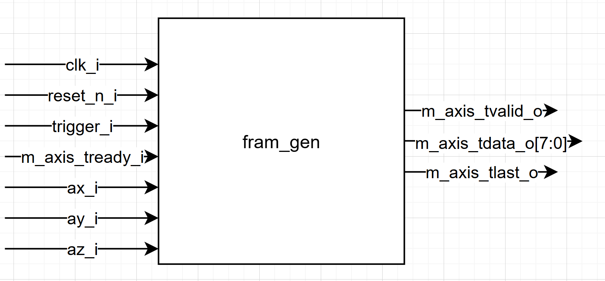
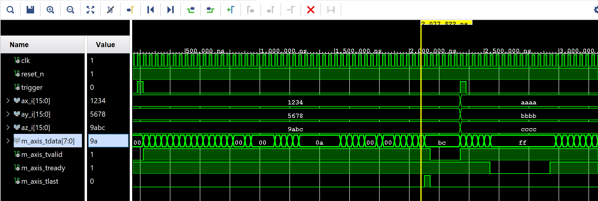

# **Ethernet Frame Generator Module (`frame_gen` & `frame_gen_debug`)**

## **1. Overview**
The **`frame_gen`** module is the heart of the Ethernet transmission stack. It acts as a hardware packet builder that encapsulates raw ADXL345 accelerometer data into a standard network hierarchy. It sits between the **Accelerometer Sub-System** (source of data) and the **MII PHY Driver** (hardware interface).

The module implements a **Master AXI-Stream interface**, pushing 48 bytes of data sequentially for every trigger pulse received.

  

## **2. Detailed Packet Structure Design**
The module is designed to generate a fixed-size packet of **48 bytes**. This specific size is chosen to encapsulate a complete UDP/IPv4 stack while remaining efficient for high-frequency sensor streaming.

### **A. Layer 2: Ethernet II Header (14 Bytes)**
* **Destination MAC (6 bytes)**: Set to the target PC's network card address.
* **Source MAC (6 bytes)**: Hardcoded unique address for the FPGA.
* **EtherType (2 bytes)**: Set to `0x0800` (IPv4).

### **B. Layer 3: IPv4 Header (20 Bytes)**
* **Version/IHL**: `0x45` (Version 4, Header Length of 5 words).
* **Length**: `0x0022` (34 bytes total for IP + UDP + Payload).
* **Identification/Flags**: Fragmentation is disabled (`0x0000`).
* **Time To Live (TTL)**: Set to `0x80` (128) as a safety guard for the direct link.
* **Protocol**: `0x11` (UDP).
* **Header Checksum**: Calculated dynamically based on RFC 791.

### **C. Layer 4: UDP Header (8 Bytes)**
* **Ports**: Source and Destination ports are set to `4096` (`0x1000`).
* **Length**: `0x000E` (UDP Header + Payload).
* **Checksum**: Set to `0x0000` (calculated as zero to save logic resources).

### **D. Layer 5: Payload (6 Bytes)**
* Encapsulates the synchronized **X, Y, and Z** axes (16-bit signed each).
* Data is sent in **Big-Endian** format (Network Byte Order).

---

## **3. Generic Configuration**
The module uses **Generics** to allow full network customization without altering the RTL logic:

| Generic | Type | Default | Description |
| :--- | :---: | :---: | :--- |
| **`mac_source`** | `vector(47:0)` | `x"112233445566"` | FPGA MAC address. |
| **`mac_dest`** | `vector(47:0)` | `x"AABBCCDDEEFF"` | PC MAC address. |
| **`ip_source`** | `vector(31:0)` | `x"0A0A0A0A"` | FPGA IP (10.10.10.10). |
| **`ip_dest`** | `vector(31:0)` | `x"0A0A0A01"` | PC IP (10.10.10.1). |
| **`payload_size`**| `integer` | `6` | Size of the sensor data (2 bytes per axis x 3 axes). |

---

### **4. Hardware Logic & Checksum Engine**
---
The module calculates the **IPv4 Header Checksum** in real-time using a combinatorial engine to ensure the PC does not drop the packets.

#### **A. The RFC 791 Algorithm**
The calculation follows the 16-bit one's complement sum method:
* **Summation**: Adds all 10 header words into a **32-bit accumulator** to catch carries.
* **Fold**: The top 16 bits (carries) are added back to the bottom 16 bits.
* **Invert**: A bitwise **NOT** is applied to the result to produce the final checksum.

#### **B. Wireshark Validation**
The hardware logic is verified by Wireshark, which confirms the integrity of the generated header.

  

* **Header Checksum**: The FPGA calculated value (e.g., `0x12ad`) is analyzed.
* **Status**: Explicitly marked as **`[correct]`** and **`Good`**, validating the RTL implementation.
---

## **5. Functional Variants**

### **A. Production Version (`frame_gen`)**
* **Inputs**: Receives live data from `ax_i`, `ay_i`, and `az_i`.
* **Trigger**: Latches data on the rising edge of `trigger_i` for temporal coherency.

### **B. Debug Version (`frame_gen_debug`)**
* **Context**: Used in `top_eth_debug`.
* **Payload**: Replaces live sensor data with a constant pattern (`x"DEADBEEF0102"`).
* **Purpose**: Validates the Ethernet link/Wireshark filters without physical hardware.

---

## **6. Input/Output Signals**

| Signal | Direction | Type | Description |
| :--- | :---: | :---: | :--- |
| **`clk_i`** | Input | `std_logic` | 25 MHz system clock. |
| **`reset_n_i`** | Input | `std_logic` | Active-low reset. |
| **`trigger_i`** | Input | `std_logic` | Pulse to start one frame transmission. |
| **`ax/y/z_i`** | Input | `std_logic_vector` | **ONLY FOR PRODUCTION**: 16-bit signed sensor data. |
| **`m_axis_tdata_o`**| Output | `std_logic_vector` | Current byte (8-bit) sent to the PHY. |
| **`m_axis_tvalid_o`**| Output | `std_logic` | AXI-Stream valid signal. |
| **`m_axis_tready_i`**| Input | `std_logic` | Back-pressure from MII Driver. |
| **`m_axis_tlast_o`** | Output | `std_logic` | High on the 48th byte (EndOfPacket). |

---

## **7. Simulation & Validation**
Validated through RTL simulation to ensure:
1. **AXI-Stream Handshake**: Pauses correctly if `tready` is deasserted.
2. **TLAST Timing**: Perfectly aligned with the 48th byte (index 47).

  

