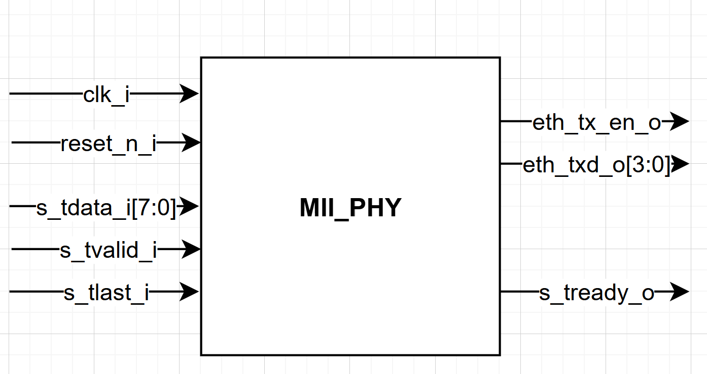
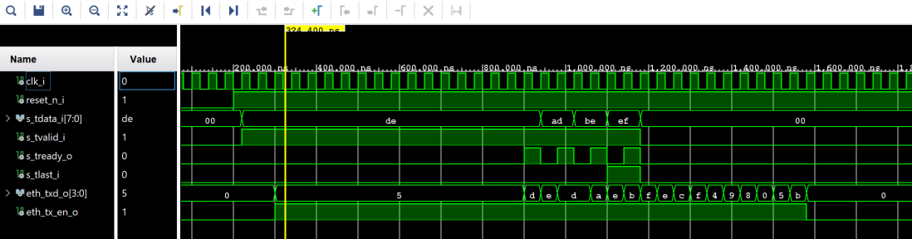

# **Ethernet MII Driver Module (`mii_phy`)**

## **1. Overview**
The **`mii_phy`** module serves as the final hardware interface between the internal FPGA logic and the physical Ethernet layer (PHY). Specifically designed for the **Arty A7** development board, it bridges an **8-bit AXI-Stream** data flow to the **4-bit MII (Medium Independent Interface)** required by the **Texas Instruments DP83848J** Ethernet PHY.

This module is a **Simplex (Transmit-only)** engine. It handles the complete encapsulation process: from fetching bytes via AXI-Stream to nibble serialization (4-bit), while managing the strict timing and protocol requirements of the IEEE 802.3 standard.

---
## **2. Block Diagram**
The **`mii_phy`** module acts as a bridge between the system's internal data generation and the physical Ethernet PHY. It orchestrates data flow using an internal FSM.

  

## **3. Technical Features**
* **Protocol Conversion**: Interfaces native **8-bit AXI-Stream** data (from `frame_gen`) to a **4-bit MII** bus.
* **Simplex Communication**: Optimized for one-way FPGA-to-PC data streaming, minimizing logic footprint.
* **IEEE 802.3 Compliant**: Automated generation of the Preamble, Start Frame Delimiter (SFD), and enforcement of the Inter-Frame Gap (IFG).
* **Hardware CRC32 Engine**: Real-time calculation and automatic insertion of the Frame Check Sequence (FCS) at the end of every packet.
* **Throughput**: Operates at 25 MHz to provide a stable 100 Mbps throughput for the Arty A7.

---

## **3. CRC32 Architecture**
Data integrity is handled by a dedicated entity instantiated within the module.
* **Source**: The VHDL code for the CRC engine was generated using the [**CRC Generator** (bues.ch)](https://bues.ch/h/crcgen) tool.
* **Configuration**: 
    * **Polynomial**: Standard Ethernet ($x^{32} + x^{26} + ... + 1$).
    * **Input Width**: 4 bits (processed per nibble to match MII throughput).
    * **Inversion**: The final result is bitwise inverted (`NOT`) before transmission to form the legal Ethernet FCS.

---

## **4. Input/Output Signals**

| Signal | Direction | Type | Description |
| :--- | :---: | :---: | :--- |
| **`clk_i`** | Input | `std_logic` | 25 MHz MII clock. |
| **`reset_n_i`** | Input | `std_logic` | Asynchronous reset (active low). |
| **`s_tdata_i[7:0]`** | Input | `std_logic_vector` | AXI-Stream data from the frame generator. |
| **`s_tvalid_i`** | Input | `std_logic` | AXI-Stream Valid: Indicates data is ready at the input. |
| **`s_tready_o`** | Output | `std_logic` | AXI-Stream Ready: Driver acknowledgment for the next byte. |
| **`s_tlast_i`** | Input | `std_logic` | AXI-Stream Last: Marks the end of the packet. |
| **`eth_txd_o[3:0]`** | Output | `std_logic_vector` | MII Transmit Data (4-bit nibbles to the physical PHY). |
| **`eth_tx_en_o`** | Output | `std_logic` | Transmit Enable: Must remain high for the entire frame duration. |

---

## **5. Internal Logic (FSM)**
The controller utilizes a Finite State Machine to sequence the Ethernet frame:

1.  **S_IDLE**: Waits for `s_tvalid_i`. Resets CRC registers at the start of every new frame.
2.  **S_PREAMBLE**: 
    * Sends 15 nibbles of `0x5` (`0101`) for receiver clock synchronization.
    * The 16th nibble is the **SFD** (`0xD` or `1101`), signaling that MAC data starts on the next cycle.
3.  **S_SEND_LSB**: 
    * Latches the AXI-Stream byte.
    * Sends the **Least Significant Nibble (LSB)** on `eth_txd_o` (MII standard requirement).
    * The CRC engine processes these first 4 bits.
4.  **S_SEND_MSB**: 
    * Sends the **Most Significant Nibble (MSB)**.
    * The CRC engine processes the remaining 4 bits of the byte.
    * **AXI-Stream Handshake**: Pulses `s_tready_o` to request the next byte from the upstream module.
5.  **S_SEND_CRC**: 
    * Triggered once `s_tlast_i` is received. Sends the 32-bit inverted CRC over 8 clock cycles.
6.  **S_IFG (Inter-Frame Gap)**: 
    * Deasserts `eth_tx_en_o`.
    * Enforces a silence period of **12 cycles** (96 bit-times) to allow network equipment to reset before the next frame.

---

## **6. Simulation and Verification (`tb_mii_phy`)**

### **A. Test Scenario**
* **Tested Payload**: `x"DE"`, `x"AD"`, `x"BE"`, `x"EF"`.
* **AXI-Stream Verification**: The testbench simulates back-pressure behavior to verify that the driver only consumes data when in the `S_SEND_MSB` state.

### **B. Critical Control Points**
* **Nibble Ordering**: Validated that for every byte, bits `(3 downto 0)` are transmitted before bits `(7 downto 4)`.
* **CRC Integrity**: Compared the transmitted CRC against a software reference calculation.
* **Inter-Packet Timing**: Confirmed that the 12-cycle Inter-Frame Gap is strictly respected before returning to the IDLE state.

  

