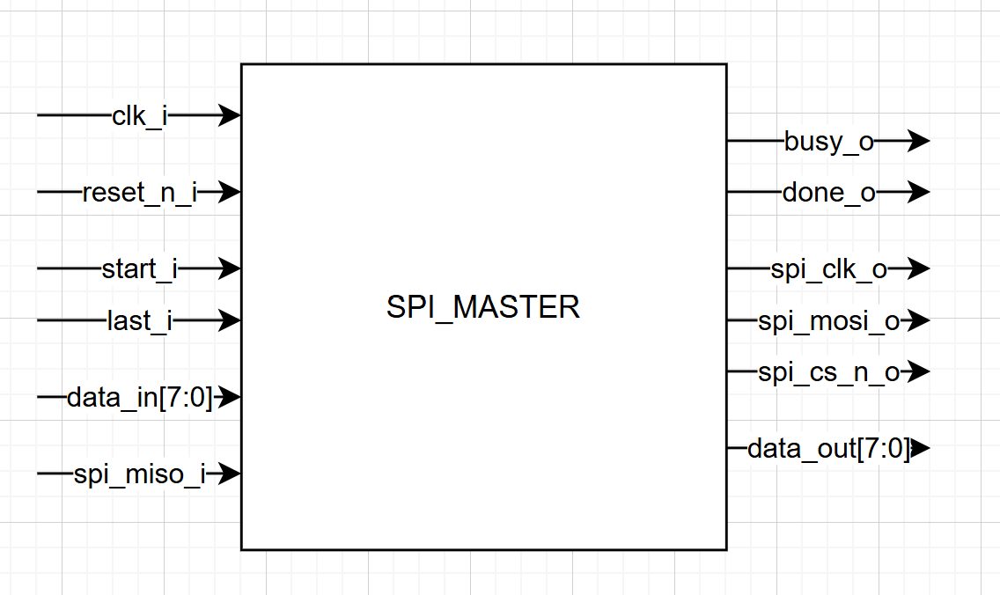
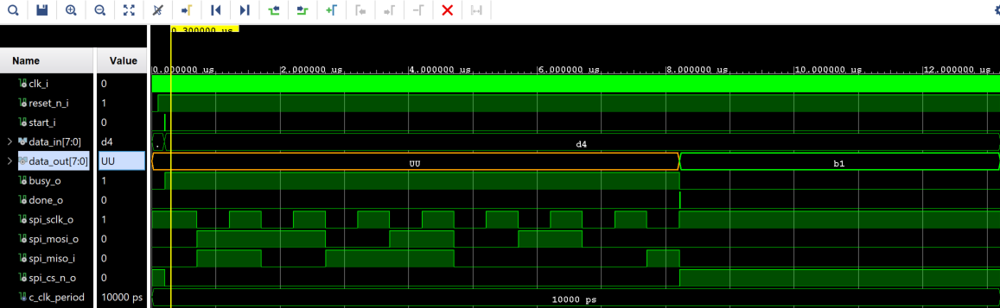

# **SPI Master Module (`spi_master`)**

## **1. Overview**
The **`spi_master`** module is the low-level communication engine of the system. It implements the **SPI Mode 3** protocol (CPOL=1, CPHA=1), ensuring reliable data exchange with external peripherals like the ADXL345.

  

---
## **2. Technical Features**
* **Dynamic Baud Rate**: The `SCLK` frequency is determined by the `g_clk_freq` and `g_sclk_freq` generics.
* **Automatic Clock Division**: The module calculates internal thresholds (`c_half`, `c_full`) to maintain a 50% duty cycle, regardless of the input clock frequency (e.g., 100MHz or 25MHz).
* **Burst Support**: It utilizes a `last_i` flag to control the `spi_cs_n_o` line, allowing for multi-byte transactions without deactivating the slave device.

---

## **3. Input/Output Signals**
The following table summarizes the hardware and control interface of the module:

| Signal | Direction | Type | Description |
| :--- | :---: | :---: | :--- |
| **`clk_i`** | Input | `std_logic` | Main system clock (must match `g_clk_freq`). |
| **`reset_n_i`** | Input | `std_logic` | Active-low asynchronous reset. |
| **`start_i`** | Input | `std_logic` | Pulse to start an 8-bit transfer. |
| **`last_i`** | Input | `std_logic` | Last byte indicator: Allows the SPI master to know if it must close the communication or leave it open for the next byte.|
| **`data_in[7:0]`** | Input | `std_logic_vector` | Byte to be sent to the peripheral (MOSI). |
| **`data_out[7:0]`** | Output | `std_logic_vector` | Byte received from the peripheral (MISO). |
| **`busy_o`** | Output | `std_logic` | High while a transfer is in progress. |
| **`done_o`** | Output | `std_logic` | Pulse indicating data is ready on `data_out`. |
| **`spi_sclk_o`** | Output | `std_logic` | Serial Clock (CPOL=1). |
| **`spi_mosi_o`** | Output | `std_logic` | Master Output Slave Input data line. |
| **`spi_miso_i`** | Input | `std_logic` | Master Input Slave Output data line. |
| **`spi_cs_n_o`** | Output | `std_logic` | Active-low Chip Select. |

---

### **SPI Master Configuration (Generics)**

The **`spi_master`** uses two primary generics to synchronize the serial communication timing according to the system and sensor constraints:

| Generic | Value | Description |
| :--- | :---: | :--- |
| **`g_clk_freq`** | `25_000_000` | **System Clock**: This value must strictly match the frequency of the input `clk_i` (25 MHz in our `top_system`) to ensure correct internal timing division. |
| **`g_sclk_freq`** | `1_000_000` | **SPI Clock**: The serial clock frequency. According to the **ADXL345 datasheet**, this value must be kept **below 5 MHz** to guarantee reliable data sampling. |

---

### **Implementation Note**
The module calculates the clock divider internally based on these two values. If you change the system clock in the `clk_wiz_0`, you **must** update `g_clk_freq` to maintain a valid SPI bit rate.

## **4. Internal Logic (FSM)**
The controller operates using a three-state Finite State Machine:

1. **S_IDLE**: The module remains inactive with `SCLK` at logic high until the `start_i` signal is asserted.
2. **S_TRANSFER**: 
   * At the **middle** of the calculated period, `SCLK` falls and the data bit is placed on **MOSI**.
   * At the **end** of the period, `SCLK` rises and the data bit from **MISO** is sampled into the internal shift register.
3. **S_FINISH**: The 8-bit data is made available on `data_out`, and the `done_o` pulse is generated to notify the upper layer.

---

## **5. Simulation & Validation**
The **`spi_master`** has been fully validated via a dedicated testbench (`tb_spi_master`) simulating a Mode 3 transaction. 

**Simulation Scenario:**
- **Master Transmission (MOSI)**: `0xD4`
- **Slave Response (MISO)**: `0xB1`
- **Clock Polarity**: Verified CPOL=1 (SCLK idles high).
- **Data Integrity**: Verified via automated VHDL assertions during the `done_o` pulse.

  

