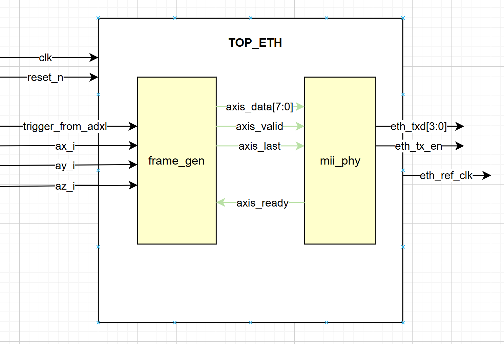

# **Ethernet Stack Top-Level (`top_eth`)**

## **1. Overview**
The **`top_eth`** module is the final integration layer of the network stack. Its primary role is to federate two critical sub-modules to ensure the seamless transmission of sensor data from the FPGA to a PC via the UDP/IP protocol:

1.  **`frame_gen` (The Architect)**: Builds the network headers (MAC, IP, UDP) and encapsulates the ADXL345 accelerometer data sourced from the `top_adxl` sub-system.
2.  **`mii_phy` (The Driver)**: Handles the physical MII interface, calculates the CRC32 (FCS), and manages nibble serialization to the physical Ethernet chip.

This architecture relies on the **AXI-Stream** standard to guarantee a robust and fluid data transfer between packet generation and physical transmission.

  

---
## **2. Input/Output Signals**.

The following table describes the top-level interface for the **Production** module. Note that in **Debug Mode**, `ax/ay/az` inputs are not present on the ports and are replaced by internal constants.

| Signal | Direction | Type | Description |
| :--- | :---: | :---: | :--- |
| **`clk`** | Input | `std_logic` | 25 MHz System/MII clock. |
| **`reset_n`** | Input | `std_logic` | Global active-low reset. |
| **`trigger_from_adxl`** | Input | `std_logic` | Strobe signal to initiate packet generation. |
| **`ax/y/z_i[15:0]`** | Input | `std_logic_vector` | **Production Only**: 16-bit signed raw data from ADXL345. |
| **`eth_txd[3:0]`** | Output | `std_logic_vector` | MII Transmit Data Nibbles to the physical PHY. |
| **`eth_tx_en`** | Output | `std_logic` | Transmit Enable (MII Standard). |
| **`eth_ref_clk`** | Output | `std_logic` | 25 MHz clock forwarded to the external PHY chip. |
| **`eth_rstn`** | Output | `std_logic` | Hardware reset for the Ethernet PHY (Fixed High). |

---

## **3. System Architecture**

The system follows a "Pipeline" structure where each block has a specific responsibility:

### **A. Frame Generator (`frame_gen`)**
* **Role**: Upon receiving a `trigger` signal, it latches the X, Y, and Z values and begins pushing the **48 bytes** of the packet (Headers + Payload).
* **Interface**: 8-bit AXI-Stream Master output.
* **Documentation**: *Refer to the dedicated README in `/frame_gen`.*

### **B. MII Driver (`mii_phy`)**
* **Role**: Receives bytes from the generator, splits them into **4-bit nibbles**, adds the preamble, and calculates the **CRC32** checksum.
* **Interface**: 8-bit AXI-Stream Slave input -> 4-bit Physical MII output.
* **Documentation**: *Refer to the dedicated README in `/mii_phy`.*

---

## **4. Inter-Module Communication (AXI-Stream)**

Synchronization between the packet builder and the physical driver is managed by the **AXI-Stream Handshake**. This mechanism ensures no data is lost if the driver is momentarily busy:

* **`TVALID`**: The generator indicates that a byte is ready to be sent.
* **`TREADY`**: The MII driver indicates it has finished sending the two nibbles of the previous byte and is ready for the next one.
* **`TLAST`**: The generator informs the driver that the current byte is the last one in the packet, triggering the transmission of the CRC32 by the driver.

---

## **5. Operating Modes & Entity Variants**

To clearly distinguish between the development and deployment phases, the system is structured into two specific top-level entities. This allows for isolated network testing before integrating the full sensor hardware.

### **A. Debug Mode Entity: `top_eth_debug`**
The **`top_eth_debug`** entity is a standalone test module. It is designed to verify the Ethernet physical link and the PC-side reception software (Wireshark) without requiring the accelerometer hardware.
* **Trigger**: A manual pulse generated by a physical button on the Arty A7 (`send_btn`).
* **Data (Payload)**: It utilizes a modified generator (`frame_gen_debug`) that ignores external inputs and sends a constant hex pattern (e.g., `x"DEADBEEF0102"`).
* **Hardware Setup**: This entity includes an internal **Clock Wizard (PLL)** to derive the 25 MHz MII clock from the 100 MHz board oscillator. It is compatible with the **`arty_eth_only.xdc`** constraints file.

  

### **B. Production Mode Entity: `top_eth`**

The **`top_eth`** entity serves as the finalized **Ethernet Transmission Sub-system**. Unlike the standalone debug version, it is specifically designed as a specialized communication component to be integrated into the larger `top_system` hierarchy.

* **Integration Role**: It acts as the bridge between the acquisition logic and the physical network.
* **Trigger**: Automatically synchronized by the hardware strobe (**`trigger_from_adxl`**) generated by the **`top_adxl`** module. This ensures that a network packet is transmitted only when a new, stable sensor sample is available.
* **Data (Payload)**: Directly maps the live **AX, AY, and AZ** 16-bit signed vectors—sourced from the sensor sub-system—into the UDP packet payload in Big-Endian format.

## **6. Network Configuration (Pre-Deployment Checklist)**

Before generating the bitstream, you **must** configure the network generics in the `top_eth` instantiation to match your hardware environment. If these values are incorrect, the PC's operating system will drop the packets.

### **. Generic Mapping Guide**

| Generic | Action | Importance |
| :--- | :--- | :--- |
| **`mac_dest`** | **Update to your PC MAC** | **Critical**: The FPGA needs this to target your specific network card. |
| **`mac_source`**| **Update with FPGA Sticker** | **Required**: Use the unique MAC address found on the white sticker near the Arty A7 RJ45 port. |
| **`ip_dest`** | **Update to your PC IP** | **Critical**: Must match the static IP address set on your Ethernet port. |
| **`ip_source`**| Keep default (10.10.10.10) | The FPGA's IP address (ensure it is in the same subnet as your PC). |

---
## **7. Physical Interface (Arty A7)**

The module directly drives the **MII (Media Independent Interface)** pins connected to the Texas Instruments PHY on the board:

* **`eth_txd[3:0]`**: 4-bit data bus.
* **`eth_tx_en`**: Transmission enable signal.
* **`eth_ref_clk`**: 25 MHz reference clock (provided by the FPGA to the PHY).
* **`eth_rstn`**: Hardware reset for the PHY component.

---
