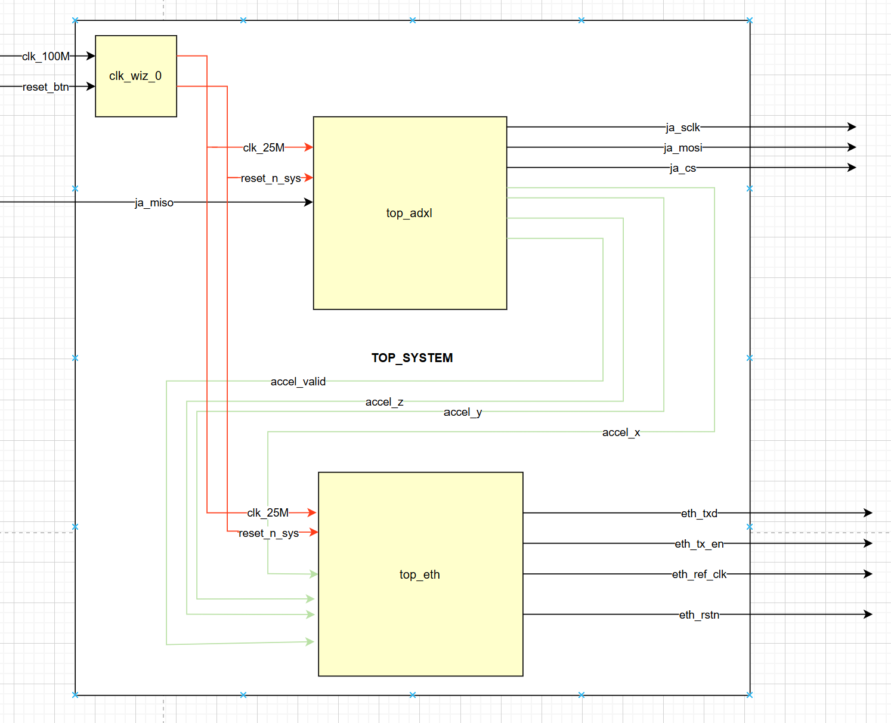
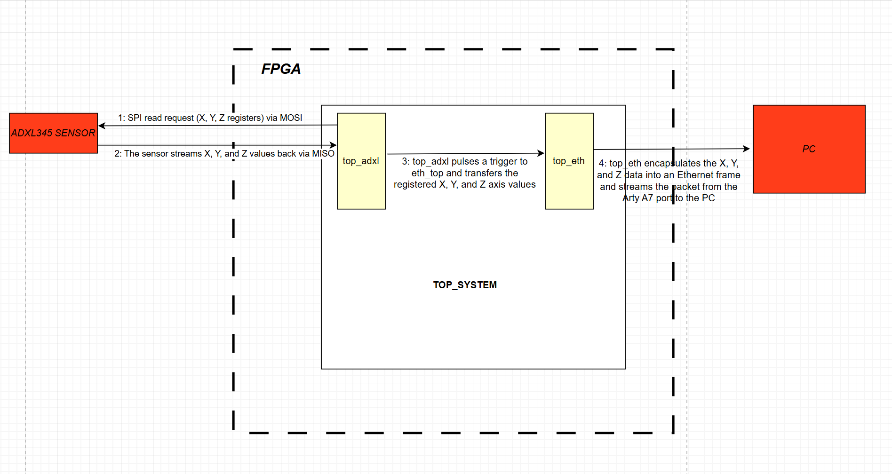

# **Top System Integration (`top_system`)**

## **1. Overview**
The **`top_system`** module is the root entity of the project. It serves as an Integrated Hardware System, merging the **SPI Acquisition domain** (ADXL345) and the **Ethernet Transmission domain** (UDP/IP Stack) into a single, cohesive processing pipeline.

Its primary function is to manage global clock distribution, synchronize the reset sequence, and establish a high-speed data path between the sensor controller and the network driver without the need for an embedded processor core.

---

## **2. System Block Diagram**

The following diagram illustrates the global interconnection. The 25 MHz system clock (derived from the 100 MHz reference) serves as the unified clock for both the SPI master and the MII Ethernet driver. This single-domain architecture meets the MII standard requirements while ensuring perfectly timed data handovers across the entire pipeline.

  

---

## **3. External Interface (I/O Mapping)**

This module must be implemented using the **`arty_a7_top.xdc`** constraints file to correctly map the following physical pins on the Artix-7 FPGA.

| Signal | Direction | Physical Pin | Description |
| :--- | :---: | :---: | :--- |
| **`clk_100M`** | Input | E3 | Arty A7 onboard 100MHz clock. |
| **`reset_btn`** | Input | C2 | Global hardware reset button (active high). |
| **`ja_sclk/mosi/cs`**| Output | Pmod JA | SPI control signals for ADXL345. |
| **`ja_miso`** | Input | Pmod JA | SPI data input from ADXL345. |
| **`eth_txd[3:0]`** | Output | PHY MII | 4-bit MII Transmit data bus. |
| **`eth_tx_en`** | Output | PHY MII | MII Transmit Enable. |
| **`eth_ref_clk`** | Output | G18 | 25MHz reference clock forwarded to the PHY. |
| **`eth_rstn`** | Output | C16 | Active-low hardware reset for the Ethernet PHY. |
| **`leds[3:0]`** | Output | LD0-LD3 | Status: LED 0 lights up when PLL is locked. |

---

## **4. Sequential Data Flow & Synchronization**

The hardware pipeline utilizes a **Strobe-and-Latch** mechanism to maintain strict data coherency across clock domains. The following diagram illustrates the step-by-step communication process from the physical sensor to the host PC:

  

### **Step-by-Step Sequence:**

1.  **SPI Read Request**: The `top_adxl` module initiates a burst read request for the X, Y, and Z registers via the MOSI line.
2.  **Sensor Response**: The ADXL345 sensor streams the 6 bytes of raw data (LSB/MSB for each axis) back to the FPGA via the MISO line.
3.  **Internal Trigger**: Once the full 3-axis sample is reconstructed, `top_adxl` pulses a trigger to `eth_top` and transfers the synchronized 16-bit registered values.
4.  **Ethernet Encapsulation**: The `top_eth` module (via `frame_gen`) encapsulates the X, Y, and Z data into an Ethernet frame and streams the final packet from the Arty A7 physical port to the host PC.

---

### **Design Considerations for Coherency:**
* **Simultaneous Latching**: To avoid "data skew" (where X and Y might belong to different time samples), the `frame_gen` module latches all 48 bits of payload data precisely on the rising edge of the trigger from `top_adxl`.
* **Strobe Protocol**: The `data_valid` pulse ensures that the Ethernet stack only transmits when new, stable data is available, preventing the redundant transmission of the same sensor sample.

## **5. Build & Implementation**

### **Clock & Reset Logic**
The hardware logic remains in a reset state until the PLL signals a `locked` status. This prevents the Finite State Machines (FSMs) from starting with an unstable clock, ensuring reliable initialization of the Texas Instruments DP83848J PHY.

### **Usage**
1.  Set **`top_system`** as the **Top Module** in the Vivado Design Suite.
2.  Apply the **`arty_a7_top.xdc`** constraints file to map the physical I/O.
3.  **IMPORTANT**: Open the `top_eth` instance and update the **Network Generics** (`mac_source`, `mac_dest`, `ip_dest`) to match your specific hardware and PC configuration.
4.  Generate the Bitstream and program the Artix-7 FPGA.

> **Note**: Skipping step 3 will result in valid hardware execution but total silence on the network side, as packets will be sent to an incorrect or non-existent MAC address.

---

## **6. Validation & Wireshark Capture**

The final validation is performed by monitoring the network traffic on the host PC. In **Production Mode**, the payload represents real-time acceleration data.

### **Data Interpretation**
* **Packet Structure**: Standard UDP over IPv4.
* **Payload Analysis**: The 6-byte payload contains three 16-bit signed integers ($A_x, A_y, A_z$).
* **Example**: $A_x$ = 0x0073, $A_y$ = 0xff09, $A_z$ = 0xff93

  

