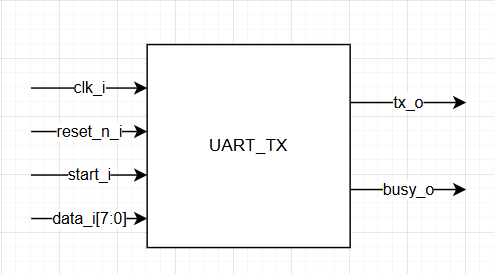

# UART Transmitter Module (`uart_tx`)

## 1. Overview
The `uart_tx` module implements a simple UART (Universal Asynchronous Receiver-Transmitter) transmitter. It converts 8-bit parallel data into a serial data stream suitable for communication with a PC serial terminal;

### Protocol Specifications:
- **Start bit**: 1 bit (logic '0').
- **Data bits**: 8 bits (transmitted LSB first).
- **Stop bit**: 1 bit (logic '1').
- **Parity**: None.

  

## 2. Input/Output Signals
The table below summarizes the ports of the `uart_tx` module:

| Signal | Direction | Type | Description |
| :--- | :---: | :---: | :--- |
| **`clk_i`** | Input | `std_logic` | System clock  |
| **`reset_n_i`** | Input | `std_logic` | Active-low asynchronous reset. |
| **`start_i`** | Input | `std_logic` | One-clock cycle pulse to initiate transmission. |
| **`data_i[7:0]`** | Input | `std_logic_vector` | 8-bit data byte to be transmitted. |
| **`busy_o`** | Output | `std_logic` | Asserted ('1') while a transmission is in progress. |
| **`tx_o`** | Output | `std_logic` | Serial output bitstream to the physical TX pin. |

---

## 3. Functional Description
Transmission is initiated by asserting `start_i` for one clock cycle. Upon detection, the module:
1. Latches the input `data_i` into an internal shift register.
2. Sets the `busy_o` signal to indicate that the transmitter is occupied.
3. Generates the timing for each bit based on the `g_baud_rate` generic.
4. Sequences through the start bit, 8 data bits, and the stop bit.

The `busy_o` signal returns to '0' once the stop bit has been fully transmitted, allowing the next byte to be loaded.

---

## 4. Generic Configuration
**Important: The value assigned to `g_clk_freq_in_hz` must strictly match the actual frequency of the clock signal connected to `clk_i`.** This parameter does not generate a clock; it is used by the internal logic to calculate the correct timing for the requested baud rate.

* **`g_clk_freq_in_hz`**: Informational parameter representing the frequency of `clk_i` (e.g., 100,000,000 for 100 MHz).
* **`g_baud_rate`**: Target transmission speed in bits per second (e.g., 115,200).

